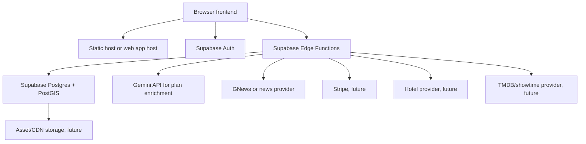
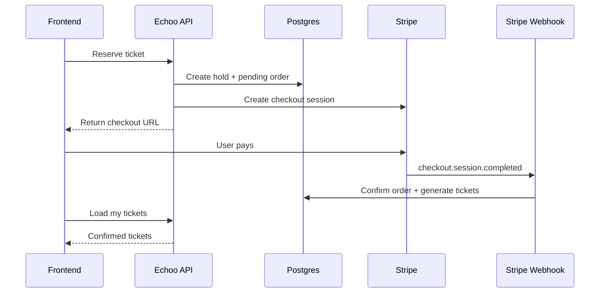

# Echoo Engineering Documentation

Prepared for Aethel Solutions, frontend engineering, and De-Pitcher, backend engineering.

Last updated: 2026-06-24

## 1. Purpose

This document defines the shared engineering contract for building Echoo from the current frontend prototype into a production platform. It is written for both teams, not as separate frontend and backend notes. The goal is that Aethel Solutions and De-Pitcher can make independent progress while preserving one product model, one data model, one API contract, and one release path.

Echoo is a Canada-first lifestyle and entertainment platform. The current codebase already contains a working static frontend prototype, shared browser helpers, Supabase Edge Functions, and database migrations for the first platform slice:

- Landing and location-gated entry.
- Authentication and onboarding preferences.
- Personalized city planner.
- Event discovery.
- Event detail pages.
- Ticket reservation and ticket lookup.
- Owner event management.
- Event operations and check-in.
- Location review tooling.
- Event-adjacent stay recommendations.

The production target is broader: events, ticketing, culture/news, date planning, movie/showtime discovery, hotel/stay recommendations, provider/talent booking, payments, and editorial operations.

## 2. Current Repository Baseline

### 2.1 Frontend Files

The frontend currently uses standalone HTML, CSS, and browser JavaScript:

| File | Current responsibility |
| --- | --- |
| `index.html` | Public landing page, Canada launch modal, city/day planning entry, mobile bottom navigation. |
| `auth.html` | Sign in, sign up, OAuth start, onboarding questionnaire, profile persistence. |
| `app.html` | Personalized app/dashboard experience, news carousel, smart plan chat, Leaflet map overlay. |
| `events.html` | Discovery/explore surface, filters, location search, smart planning results. |
| `event.html` | Event detail, related plans, nearby stays, ticket reservation. |
| `tickets.html` | Ticket lookup by email or local session id. |
| `owner-events.html` | Admin event creation/editing, tiers, pending order confirmation. |
| `event-ops.html` | Inventory, attendee, order, event status, and operational management. |
| `checkin.html` | Manual ticket code or QR token check-in. |
| `admin-locations.html` | Location moderation/review. |
| `assets/echoo-auth.js` | Supabase browser auth client, onboarding profile read/write, auth headers. |
| `assets/location-platform.js` | Client-side Canada bounds, supported city lookup, local location preference handling. |
| `assets/activity-context.js` | Client support for activity context and personalization. |

This prototype is valuable, but production should move toward a maintainable application structure. The roadmap recommends either a disciplined componentized static architecture for MVP or a Next.js/React migration before heavy feature growth.

### 2.2 Backend Files

The backend baseline is Supabase:

| Area | Files |
| --- | --- |
| Shared utilities | `supabase/functions/_shared/location.ts` |
| Location search/review | `location-search`, `location-normalize`, `location-review` |
| Planning | `plan-engine` |
| Events and tickets | `event-detail`, `event-manage`, `ticket-reserve`, `ticket-confirm`, `ticket-ops`, `ticket-checkin`, `my-tickets` |
| Stays | `event-stays` |
| Culture/news | `fetch-news` |
| Database | migrations under `supabase/migrations/` |

The current backend is already more than a mock. It has PostgreSQL tables, RLS policies, PostGIS search functions, ticket hold/confirm stored procedures, event operations, and admin-token protected flows.

## 3. Product Scope

### 3.1 Launch Position

Echoo should launch as:

> Canada-first discovery, planning, event, and ticketing platform for culture, dates, live events, movies, and local experiences.

The platform should remain global-ready, but production functionality should be restricted to Canada until business operations, compliance, provider partnerships, and support capacity are ready for more regions.

### 3.2 Primary User Roles

| Role | Description | Primary surfaces |
| --- | --- | --- |
| Consumer | Discovers plans, buys tickets, saves guides, views tickets. | Landing, app, explore, event detail, tickets, profile. |
| Event organizer | Creates events, manages ticket inventory and attendees. | Owner events, event ops, check-in. |
| Talent/provider | Offers bookable services such as DJs, hosts, photographers, food vendors. | Future provider dashboard and public talent profiles. |
| Editor/admin | Reviews locations, curates news and guides, manages featured content. | Location review, future editorial console. |
| Platform operator | Manages configuration, supported regions, payments, integrations, abuse controls. | Admin dashboards, Supabase/backend observability. |

### 3.3 MVP Product Modules

MVP should focus on:

- Location-gated Canadian discovery.
- Authenticated onboarding and preferences.
- Personalized plan generation.
- Event directory and event detail.
- Ticket reservation, confirmation, lookup, and check-in.
- Owner/admin event management.
- Seeded stay recommendations around events.
- News carousel backed by a real `news` table and ingestion job.

Post-MVP modules:

- Stripe checkout and webhook-driven ticket confirmation.
- Full editorial queue.
- Movie/showtime API integration.
- Hotel provider integration or affiliate partner integration.
- Date guide builder and save/share.
- Talent marketplace, provider profiles, and booking escrow.

## 4. System Architecture

### 4.1 Launch Architecture



### 4.2 Production Architecture Direction

The Supabase launch stack is acceptable for MVP. The platform must be designed so that the following can be added without rewriting product logic:

- API gateway or backend service layer for high-traffic routes.
- Redis for query cache, ticket pressure, and external API caching.
- Background workers for ingestion, enrichment, email, tickets, and notifications.
- Stripe webhooks and reconciliation jobs.
- CDN image optimization and static asset caching.
- Observability with structured logs, traces, alerts, and business metrics.

## 5. Shared Engineering Principles

1. The frontend must call Echoo-owned APIs, not third-party data APIs directly, except public map tile rendering when approved.
2. Backend responses must be stable, typed, versioned when breaking changes are necessary, and safe for unauthenticated clients where public data is intended.
3. Canada gating must live centrally in backend APIs and configuration, with frontend UX supporting the decision.
4. Ticket inventory must be protected by transactional backend logic. The frontend must never calculate availability as authority.
5. User preference and location data are sensitive. Store the minimum needed and never expose precise user coordinates to other users.
6. Admin actions must not rely on local storage tokens long term. Admin token protection is acceptable for prototype only.
7. Every feature shipped to users needs a loading state, empty state, error state, and retry path.
8. External provider data must be cached and normalized into Echoo-owned records where legally permitted.

## 6. Data Model

### 6.0 Ontario Intelligence Addendum

The Ontario-first local intelligence build is specified in `docs/ontario-intelligence-implementation-plan.md`.

That document is the implementation source of truth for extending `canonical_places`, `location_entities`, ingestion, AI enrichment, retrieval-first chat behavior, and admin review into a province-wide Ontario knowledge layer. Future planning/chat work should read it before changing `plan-engine`, `discover-live`, `location-search`, or location review tooling.

### 6.1 Existing Core Tables

The existing migrations define the following tables:

| Table | Purpose |
| --- | --- |
| `supported_regions` | Canada-first launch configuration by country, province, city, feature flags, currency, timezone. |
| `canonical_places` | Normalized places from providers or manual review. |
| `location_entities` | Searchable public items such as events, guides, movies, and local plans. |
| `user_location_preferences` | User location preferences and rounded location metadata. |
| `user_onboarding_profiles` | Authenticated onboarding and personalization preferences. |
| `ticketed_events` | Ticketed event records. |
| `ticket_tiers` | Price/capacity tiers for an event. |
| `ticket_holds` | Temporary ticket reservations. |
| `ticket_orders` | Ticket orders and payment status. |
| `payment_attempts` | Payment provider attempts and metadata. |
| `ticket_items` | Individual generated tickets with QR/display codes. |
| `ticket_checkin_logs` | Audit trail for check-in attempts. |
| `event_stays` | Seeded or partner stay recommendations for event detail pages. |

### 6.2 Required New Tables

The current app queries `news`, but the repository does not currently include a migration that creates it. De-Pitcher should add it before production.

#### `news`

| Column | Type | Notes |
| --- | --- | --- |
| `id` | uuid | Primary key. |
| `title` | text | Display headline. |
| `slug` | text | Unique public slug. |
| `summary` | text | Short card/body summary. |
| `content` | text | Optional article body. |
| `url` | text | Source or canonical URL. |
| `image_url` | text | CDN/proxy image where possible. |
| `source_name` | text | Provider/source. |
| `category` | text | `music`, `movies`, `nightlife`, `sports`, `date`, `culture`, etc. |
| `city` | text | Nullable. |
| `province` | text | Nullable. |
| `country_code` | text | Default `CA`. |
| `published_at` | timestamptz | Source publication date. |
| `editor_status` | text | `pending_review`, `approved`, `featured`, `archived`. |
| `metadata` | jsonb | Provider ids, tags, enrichment data. |
| `created_at` | timestamptz | Insert timestamp. |
| `updated_at` | timestamptz | Update timestamp. |

Minimum public read policy: approved or featured Canadian records are readable.

#### Future tables

| Table | Purpose |
| --- | --- |
| `date_guides` | Curated or user-created itineraries. |
| `date_guide_steps` | Ordered guide steps linked to restaurants, events, movies, hotels, or places. |
| `movies` | TMDB-normalized movie records. |
| `cinemas` | Theater/venue records with location. |
| `showtimes` | Showtime data by movie/cinema/date. |
| `talent_profiles` | Provider profiles, pricing, media, service areas. |
| `provider_availability` | Calendar availability and blackout windows. |
| `bookings` | Talent/provider booking requests and lifecycle. |
| `booking_messages` | Conversation records for bookings. |
| `reviews` | Reviews for providers, events, guides, and stays. |
| `saved_items` | User saves for events, guides, articles, and providers. |
| `audit_logs` | Structured admin action log. |

## 7. API Contract

All production APIs should return JSON using consistent shapes:

```json
{
  "data": {},
  "error": null,
  "meta": {}
}
```

The existing Edge Functions currently return direct objects. That is acceptable for the current prototype, but new production APIs should adopt the envelope above. If the existing routes are changed, Aethel Solutions and De-Pitcher must coordinate a small compatibility layer.

### 7.1 Auth Headers

Public reads:

```http
Authorization: Bearer <supabase anon key or user access token>
apikey: <supabase anon key>
Content-Type: application/json
```

Authenticated user flows:

```http
Authorization: Bearer <user access token>
apikey: <supabase anon key>
Content-Type: application/json
```

Prototype admin flows:

```http
x-admin-token: <admin token>
Content-Type: application/json
```

Production admin flows must use authenticated role-based authorization, not shared admin tokens.

### 7.2 Existing Route Summary

| Route | Method | Owner | Used by | Purpose |
| --- | --- | --- | --- | --- |
| `/functions/v1/location-search` | GET/POST | Backend | `app.html`, `events.html` | Search location-backed entities by coordinates or supported city. |
| `/functions/v1/plan-engine` | POST | Backend | `app.html`, `events.html`, `event.html` | Build personalized plan suggestions. |
| `/functions/v1/event-detail` | GET | Backend | `event.html` | Load event and ticket tiers. |
| `/functions/v1/event-stays` | GET | Backend | `event.html` | Load ranked nearby stay recommendations. |
| `/functions/v1/ticket-reserve` | POST | Backend | `event.html` | Reserve tickets and auto-confirm free RSVPs. |
| `/functions/v1/ticket-confirm` | POST | Backend/Admin | `owner-events.html` | Confirm manual paid orders. |
| `/functions/v1/my-tickets` | GET | Backend | `tickets.html` | Lookup confirmed ticket items. |
| `/functions/v1/event-manage` | GET/POST/PATCH | Backend/Admin | `owner-events.html` | Create/update/list events and tiers, list pending orders. |
| `/functions/v1/ticket-ops` | GET/POST/PATCH | Backend/Admin | `event-ops.html` | Load and mutate event operations. |
| `/functions/v1/ticket-checkin` | POST | Backend/Admin | `checkin.html` | Validate and mark ticket as checked in. |
| `/functions/v1/location-review` | GET/PATCH | Backend/Admin | `admin-locations.html` | Review canonical places. |
| `/functions/v1/fetch-news` | POST/cron | Backend | Ingestion | Fetch and store entertainment/city news. |

### 7.3 Route Details

#### `location-search`

Request:

```json
{
  "lat": 43.6532,
  "lng": -79.3832,
  "city": "Toronto",
  "radiusMeters": 25000,
  "entityType": "event",
  "category": "music",
  "limit": 50
}
```

Response today:

```json
{
  "supported": true,
  "mode": "nearby",
  "region": {
    "name": "Toronto",
    "province": "ON",
    "timezone": "America/Toronto",
    "distanceMeters": 2300
  },
  "radiusMeters": 25000,
  "results": []
}
```

Backend requirements:

- Clamp radius from 1,000 to 100,000 meters.
- Clamp limit from 1 to 100.
- Block non-Canadian coordinate search with a graceful `supported: false` response.
- Cache equivalent searches with rounded coordinates.
- Log slow search and unsupported region events.

Frontend requirements:

- Provide city fallback when geolocation is denied.
- Show unsupported Canada launch copy for non-Canadian users.
- Treat `results: []` as a valid empty state, not an error.

#### `plan-engine`

Request:

```json
{
  "city": "Toronto",
  "query": "date night with music",
  "mode": "build_plan",
  "budget": "$$",
  "energy": "curious",
  "limit": 4,
  "profile": {
    "interests": ["Live music", "Food"],
    "eventStyles": ["Quiet events"],
    "motivations": ["Find a date"],
    "tone": "direct"
  }
}
```

Backend requirements:

- If a user access token is present, merge saved onboarding profile with the request.
- Use deterministic candidate ranking before LLM enrichment.
- Return usable fallback plan content when Gemini is unavailable.
- Never include raw private profile data in logs.

Frontend requirements:

- Render plan stops even if AI copy is missing.
- Preserve previous plan context for follow-up prompts.
- Avoid sending precise coordinates unless the user has granted location access.

#### `event-detail`

Request:

```http
GET /functions/v1/event-detail?id=<ticketed_event_id_or_location_entity_id>
```

Response today:

```json
{
  "event": {
    "id": "uuid",
    "title": "Basement listening room",
    "venue_name": "Venue",
    "city": "Toronto",
    "province": "ON",
    "country_code": "CA",
    "starts_at": "2026-06-25T20:00:00Z",
    "status": "published"
  },
  "tiers": [
    {
      "id": "uuid",
      "name": "General",
      "price_cents": 2500,
      "currency": "CAD",
      "remaining_quantity": 50,
      "sale_status": "on_sale"
    }
  ]
}
```

Backend requirements:

- Release expired holds before loading event data.
- Only return published Canadian events publicly.
- Sort tiers by `sort_order`.

Frontend requirements:

- Hide reservation UI when no tiers exist.
- Display sold-out/paused states by tier.
- Use server values for remaining inventory.

#### `ticket-reserve`

Request:

```json
{
  "eventId": "uuid",
  "tierId": "uuid",
  "quantity": 2,
  "buyerEmail": "buyer@example.com",
  "buyerName": "Buyer Name",
  "sessionId": "browser-session-id"
}
```

Response today includes:

- `order`
- `hold`
- `tier`
- `event`
- `paymentAttempt`
- `confirmed` for free RSVP orders
- `paymentGateway`

Backend requirements:

- Quantity must be 1 to 10.
- Reservation must be transactional.
- Paid orders must not be confirmed until payment is successful.
- Hold expiry is 5 minutes.
- Stripe integration must replace manual paid confirmation in production.

Frontend requirements:

- Disable submit while reserving.
- Show hold expiry when a payment flow is introduced.
- Store a stable anonymous `sessionId` for ticket lookup.
- For paid events before Stripe launch, communicate manual confirmation clearly.

#### `ticket-checkin`

Request:

```json
{
  "eventId": "uuid",
  "code": "TOR-B3A513AC",
  "operatorLabel": "Door 1"
}
```

Response statuses:

- `valid`
- `already_used`
- `wrong_event`
- `invalid`

Backend requirements:

- All attempts must write `ticket_checkin_logs`.
- Duplicate check-in must never update the ticket again.
- Wrong event and invalid attempts must be auditable.

Frontend requirements:

- Keep scan/input fast and keyboard friendly.
- Use high-contrast states for valid, already used, wrong event, and invalid.
- After a valid scan, clear input and focus for next scan.

## 8. Frontend and Backend Ownership

### 8.1 Aethel Solutions Owns

- Visual implementation and frontend architecture.
- Routing and navigation.
- UI state management.
- Responsive behavior.
- Accessibility.
- Client-side validation that improves UX.
- API integration clients and frontend error handling.
- Frontend tests and browser verification.
- Analytics event emission from the browser.

### 8.2 De-Pitcher Owns

- Database schema, migrations, RLS, stored procedures.
- Edge Functions or backend service APIs.
- Authentication, authorization, and role enforcement.
- Ticketing concurrency and payment integrity.
- External API integrations.
- Data ingestion and enrichment jobs.
- Backend tests and observability.
- Security hardening and deployment operations.

### 8.3 Shared Decisions

These must be agreed before implementation:

- API response shape and versioning.
- Auth session model and role model.
- Error code taxonomy.
- Event/category taxonomy.
- Supported city/region configuration.
- Payment provider lifecycle.
- Analytics event names.
- Data retention rules.
- Definition of done per milestone.

## 9. Security and Privacy

### 9.1 Immediate Security Gaps

The following are acceptable for a prototype but must be fixed for production:

- Admin operations use shared `x-admin-token` values stored in browser local storage.
- Supabase URLs and anon keys are hard-coded in multiple files.
- CORS allows all origins.
- Paid ticket confirmation can be forced by admin token.
- There is no full role-based admin dashboard.
- News table migration is missing while frontend queries it.

### 9.2 Production Requirements

- Use Supabase Auth roles or custom claims for `consumer`, `organizer`, `editor`, `admin`, `platform_operator`.
- Replace admin tokens with authenticated role checks.
- Restrict CORS to production/staging domains.
- Move config into environment-specific build configuration.
- Store secrets only in backend environment variables.
- Add audit logs for admin and financial operations.
- Add rate limiting for auth, ticket reservation, check-in, and planning.
- Add webhook signature verification for Stripe.
- Never store raw payment card data.
- Store rounded/passive location data only unless exact location is essential.

## 10. Payments and Ticketing

### 10.1 Current State

The current ticketing system supports:

- Event and tier creation.
- Inventory decrement on reservation.
- Five-minute active holds.
- Free ticket auto-confirmation.
- Manual paid order confirmation.
- Ticket generation with QR token and display code.
- Ticket lookup.
- Check-in and logs.

### 10.2 Production Payment Flow



Backend must make webhook confirmation idempotent. Frontend must never mark an order paid based only on redirect success.

## 11. Location and Canada Gate

Supported launch cities currently include:

- Toronto
- Vancouver
- Montreal
- Calgary
- Edmonton
- Ottawa
- Winnipeg
- Quebec City
- Halifax
- Victoria

Rules:

- Canada is active at country level.
- Transactional flows outside Canada should be blocked gracefully.
- Discovery should work through manual city selection when geolocation is denied.
- Frontend and backend city lists must not drift. Production should load supported regions from an API instead of duplicating constants in `location.ts` and `location-platform.js`.

## 12. AI Planning

The planning engine should operate in three layers:

1. Candidate retrieval from Echoo-owned location/search data.
2. Deterministic scoring using distance, freshness, category, budget, profile signals, and availability.
3. LLM enrichment for copy, route title, summary, and explanation.

Requirements:

- AI output must not invent bookable inventory.
- AI output must reference only returned candidates unless clearly marked as general advice.
- The backend should validate/parse AI JSON and provide deterministic fallback.
- The frontend should not expose raw model errors.
- Saved user preferences can inform planning only for the authenticated user.

## 13. News and Culture Pipeline

The target ingestion pipeline:


MVP can use a simple `news` table with `approved` rows. Production should add:

- Provider-specific dedupe keys.
- Source attribution.
- Editorial status.
- City and category tagging.
- Image validation/proxying.
- Takedown/archive workflow.
- Automated expiry of stale entertainment headlines.

## 14. Error Handling

All APIs should standardize:

| HTTP | Meaning | Frontend behavior |
| --- | --- | --- |
| 200 | Successful response, including valid empty states. | Render data or empty state. |
| 400 | Malformed request. | Show friendly correction copy. |
| 401 | Not authenticated or invalid admin/user token. | Redirect to auth or show admin login. |
| 403 | Authenticated but not allowed. | Show access denied. |
| 404 | Entity not found or not public. | Show not found page/state. |
| 409 | Conflict, such as already checked in or wrong event. | Show conflict-specific UI. |
| 422 | Valid JSON but missing/invalid business fields. | Show inline validation. |
| 429 | Rate limited. | Ask user to wait and retry. |
| 500 | Unexpected server error. | Show retry and log event. |

Backend responses should include machine-readable codes:

```json
{
  "error": {
    "code": "TICKET_HOLD_EXPIRED",
    "message": "Ticket hold expired."
  }
}
```

## 15. Observability

Backend must log:

- Request id.
- User id when authenticated.
- Route/function name.
- Duration.
- Status code.
- Error code.
- Cache hit/miss.
- Region/city where relevant.
- Payment provider references where relevant, without sensitive data.

Frontend must emit:

- Page view.
- Search submitted.
- Location allowed/denied/manual city.
- Plan requested and rendered.
- Event card opened.
- Ticket reserve started/succeeded/failed.
- Checkout redirect started.
- Ticket lookup.
- Check-in action result for admin users.

Business metrics:

- Activation rate after onboarding.
- Plan requests per active user.
- Event detail conversion rate.
- Ticket reservation to confirmation rate.
- Check-in success rate.
- News carousel engagement.
- Unsupported region attempts.

## 16. Testing Strategy

### 16.1 Backend

Required tests:

- Database migration smoke test.
- RLS policy tests for public, user, organizer, admin.
- Stored procedure tests for ticket reservation, hold expiry, confirmation, and oversell prevention.
- Edge Function tests for success, validation, auth, and error paths.
- Stripe webhook idempotency tests when implemented.
- Location search tests for supported city, coordinates, unsupported city, and outside Canada.

### 16.2 Frontend

Required tests:

- Landing location modal behavior.
- Auth/onboarding happy path and validation path.
- App planner loading, fallback, and empty states.
- Explore filters and search.
- Event detail render with tiers, without tiers, sold out, and API error.
- Ticket reservation happy path and failure path.
- Ticket lookup.
- Owner event form validation.
- Event ops status/tier updates.
- Check-in statuses.

### 16.3 End-to-End Release Scenarios

Each release candidate must verify:

1. New user signs up and completes onboarding.
2. User manually selects Toronto and sees discovery results.
3. User requests a date night plan and opens an event.
4. User reserves a free ticket and sees it under My Tickets.
5. Owner creates a paid event and tier.
6. Admin confirms a pending paid order in prototype mode.
7. Door operator checks in a valid ticket.
8. Door operator attempts the same ticket again and sees already used.
9. Non-Canada coordinates return a Canada-first message.
10. Published events appear in discovery and archived events do not.

## 17. Deployment Environments

Use at least three environments:

| Environment | Purpose |
| --- | --- |
| Local | Developer iteration with local Supabase where possible. |
| Staging | QA, integration, demos, test payments, seeded data. |
| Production | Real users, real payments, restricted admin access. |

Required environment variables:

- `SUPABASE_URL`
- `SUPABASE_ANON_KEY`
- `SUPABASE_SERVICE_ROLE_KEY`
- `GEMINI_API_KEY`
- `GNEWS_API_KEY`
- `STRIPE_SECRET_KEY`
- `STRIPE_WEBHOOK_SECRET`
- `APP_BASE_URL`
- `ALLOWED_ORIGINS`

Prototype variables still present:

- `LOCATION_ADMIN_TOKEN`
- `TICKETING_ADMIN_TOKEN`

These should be removed from frontend-dependent production workflows after RBAC is implemented.

## 18. Configuration Contract

Frontend should receive config from one source:

```js
window.ECHOO_CONFIG = {
  environment: "staging",
  supabaseUrl: "...",
  supabaseAnonKey: "...",
  apiBaseUrl: "...",
  supportedCountry: "CA"
};
```

Do not hard-code endpoint URLs in every page long term. Aethel Solutions should introduce a shared API client. De-Pitcher should provide stable environment-specific endpoints.

## 19. Accessibility and UX Requirements

Frontend production baseline:

- Keyboard navigable forms, modals, menus, ticket controls, and check-in flow.
- Visible focus states.
- Sufficient color contrast.
- Semantic headings and landmarks.
- Form labels bound to inputs.
- Status messages with appropriate `role="status"` or `aria-live`.
- Touch targets suitable for mobile.
- No layout shift when dynamic text loads.
- Error messages next to the control or region they affect.

## 20. Definition of Done

A feature is done only when:

- API contract is documented.
- Database migration is committed if schema changed.
- RLS/authorization is implemented.
- Frontend has loading, empty, error, and success states.
- Happy path and at least one failure path are tested.
- Observability event/log exists.
- Staging validation is complete.
- Product owner can exercise the flow without developer tools.
- Any temporary prototype compromise is recorded in the roadmap debt list.

## 21. Open Decisions

These should be resolved before the next build sprint:

1. Will the frontend remain static HTML for MVP or move to Next.js/React now?
2. What is the production admin role model?
3. Which payment provider account and Stripe Connect approach will be used?
4. Will event organizers be self-serve in MVP or platform-managed only?
5. What legal terms are required for ticket sales, refunds, location usage, and affiliate stay links?
6. What news provider and usage rights are approved?
7. Is the first launch city Toronto-only operationally, or all configured Canadian cities?
8. What brand voice rules should the AI planner and news enrichment follow?
