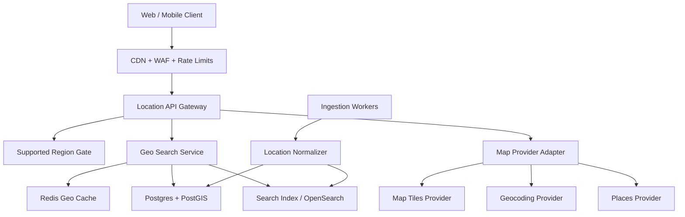

# Architectural Plan: Scaling Geolocation & Mapping for Millions of Users

## Position

Echoo should launch with Canada as the only active operating region while building the location platform as if more countries will be enabled later. That gives the product a sharp production scope, keeps moderation and vendor partnerships manageable, and avoids rewriting the mapping/search foundation when expansion begins.

The principle is:

**Global-ready infrastructure, Canada-gated functionality.**

Users outside Canada can still view public brand pages, but location discovery, booking, ticketing, event publishing, hotel/date planning, and map search should be restricted to supported Canadian regions until operations are ready elsewhere.

---

## Launch Scope

### Canada P0

- Canada-wide geolocation search and event discovery.
- Province, city, neighborhood, and venue-level browsing.
- Distance-based event feeds.
- "Near me" search for events, date guides, cinemas, restaurants, hotels, and talent.
- Region-aware content ingestion and editorial queues.
- Geofenced organizer/provider publishing.
- Fast map/list views for high-traffic cities such as Toronto, Vancouver, Montreal, Calgary, Edmonton, Ottawa, Winnipeg, Quebec City, Halifax, and Victoria.

### Global Later

- Country enablement by configuration, not code rewrites.
- Country-specific compliance, currency, tax, moderation, provider onboarding, and vendor API rules.
- Regional search shards or read replicas only after actual traffic requires them.

---

## Core Architecture



---

## Data Model Foundation

Use PostgreSQL with PostGIS as the source of truth for location-aware entities.

### Required Location Fields

Every location-backed entity should store:

- `country_code` such as `CA`
- `admin_area_1` for province or territory
- `admin_area_2` for county/region when available
- `city`
- `neighborhood`
- `postal_code`
- `formatted_address`
- `latitude`
- `longitude`
- `location geography(Point, 4326)`
- `geohash` or `h3_cell`
- `timezone`
- `place_provider`
- `place_provider_id`
- `confidence_score`
- `is_supported_region`

### Entities That Need Coordinates

- Events
- Venues
- Talent/provider service areas
- Cinemas
- Restaurants/date spots
- Hotels
- User approximate location
- Editorial city hubs
- Organizer business addresses

### Indexes

Use:

- GiST index on `location`
- B-tree index on `country_code`
- B-tree composite index on `(country_code, admin_area_1, city)`
- Optional H3/geohash index for feed pre-grouping
- Search index for text queries like venue names, artists, neighborhoods, and event titles

Example query pattern:

```sql
SELECT id, title, venue_name, starts_at
FROM events
WHERE country_code = 'CA'
  AND status = 'published'
  AND starts_at >= now()
  AND ST_DWithin(
    location,
    ST_SetSRID(ST_MakePoint(:lng, :lat), 4326)::geography,
    :radius_meters
  )
ORDER BY starts_at ASC
LIMIT 50;
```

---

## Canada Region Gate

Do not scatter Canada-only checks across the product. Centralize them.

Create a `supported_regions` configuration table:

| Field | Example |
| --- | --- |
| `country_code` | `CA` |
| `admin_area_1` | `ON` |
| `city` | `Toronto` |
| `status` | `active`, `preview`, `blocked` |
| `features_enabled` | `events`, `tickets`, `talent`, `date_guides`, `hotels` |
| `currency` | `CAD` |
| `timezone` | `America/Toronto` |

At launch:

- `country_code = CA` is active.
- Other countries are blocked for transactional flows.
- Unsupported regions return a graceful message: Echoo is launching in Canada first.

This lets the app expand by data/config later instead of editing core product logic.

---

## Mapping Provider Strategy

Avoid coupling Echoo directly to one map vendor. Build an internal adapter layer:

- `geocode(address)`
- `reverseGeocode(lat, lng)`
- `searchPlaces(query, location, radius)`
- `getStaticMap(bounds)`
- `getMapTiles(style, z, x, y)`
- `calculateDistance(origin, destination)`

The frontend should call Echoo APIs, not vendor APIs directly, except for public map tile rendering when appropriate.

Recommended launch pattern:

- Use one primary provider for tiles/geocoding/places.
- Cache all geocoding and place lookups aggressively.
- Store provider IDs, but keep Echoo-owned normalized location records.
- Keep the provider replaceable before global expansion.

---

## Performance Strategy

### Hot Path: Browse Nearby

Target response time: under 150 ms from API to data response for cached city/radius queries.

Use a layered approach:

1. Edge cache public city landing pages.
2. Redis cache common geo queries such as `events:CA:ON:Toronto:music:this_week`.
3. PostGIS for precise radius queries.
4. Search index for text plus geo ranking.
5. Async workers for enrichment, not live request processing.

### Cache Keys

Use stable region buckets:

```text
events:CA:ON:Toronto:all:7d
events:CA:BC:Vancouver:music:weekend
guides:CA:QC:Montreal:date-night
hotels:event:{event_id}:5km
```

### Map Loading

- Render list results first; map can hydrate after initial content.
- Cluster markers server-side or client-side depending on result count.
- Cap first map load to 50-100 pins.
- Use bounding-box queries when the user pans the map.
- Debounce map movement requests.
- Lazy-load hotels/date spots until the user opens an event or itinerary.

---

## User Location Privacy

Location is sensitive. Treat it as production-critical, not cosmetic.

Rules:

- Ask for precise browser location only when needed.
- Support manual city selection as the default fallback.
- Store approximate user location unless exact location is required for a live feature.
- Never expose raw user coordinates to other users.
- Round or bucket passive analytics coordinates.
- Keep location consent and last selected city separate.

Recommended user fields:

- `home_country_code`
- `home_city`
- `last_selected_region`
- `last_location_precision` such as `manual_city`, `postal_code`, `gps`
- `location_consent_at`

---

## Search Ranking

Geo search should not be only "nearest first." Echoo is an experience platform, so ranking should combine:

- Distance
- Event start time
- Popularity
- Ticket availability
- Editorial boosts
- Friend/group relevance
- User interests
- Freshness
- Trust/safety score

For Canada launch, keep ranking explainable and deterministic:

```text
score =
  distance_score * 0.25 +
  starts_soon_score * 0.20 +
  popularity_score * 0.20 +
  availability_score * 0.15 +
  personalization_score * 0.15 +
  editorial_boost * 0.05
```

Machine learning can come later once Echoo has enough behavior data.

---

## Ingestion & Location Normalization

Every external event, hotel, cinema, restaurant, or venue record should pass through a normalization pipeline before it becomes searchable.

Pipeline:

1. Ingest raw provider data.
2. Normalize address.
3. Geocode if coordinates are missing.
4. Validate country is Canada for launch.
5. Attach province/city/neighborhood/timezone.
6. Deduplicate against existing venues.
7. Assign confidence score.
8. Store canonical venue/place record.
9. Publish searchable entity only if confidence passes threshold.

This prevents duplicate venues and broken maps at scale.

---

## Reliability & Scale

### Read Scale

- Keep browse/search endpoints read-heavy and cacheable.
- Use read replicas before considering database sharding.
- Partition large event/history tables by country and time when needed.

### Write Scale

- Ticket reservations, provider updates, and organizer publishing remain transactional.
- Use queues for geocoding, enrichment, emails, notifications, and article ingestion.
- Do not call external map/place APIs inside payment or booking transactions.

### Failure Modes

If geocoding fails:

- Save the draft with `location_status = needs_review`.
- Do not publish the listing to map search.

If map provider is down:

- Keep list/search working.
- Hide or degrade map view.
- Serve cached coordinates and static map images where available.

If Redis is down:

- Fall back to PostGIS queries with tighter rate limits.
- Temporarily disable broad radius searches if needed.

---

## Launch Phases

### Phase 1: Canada Foundation

- Add canonical location fields.
- Add `supported_regions`.
- Add PostGIS indexes.
- Build `LocationService`.
- Gate transactional features to Canada.
- Support manual city selection and browser geolocation.
- Build fast event/date guide radius search.

### Phase 2: Canada Depth

- Add venue deduplication.
- Add city hub pages.
- Add cached hotel/cinema/date spot lookups.
- Add marker clustering.
- Add observability by city and provider.
- Add editorial region controls.

### Phase 3: Canada Scale

- Add Redis query caching.
- Add read replicas.
- Add search index for text plus geo.
- Add queue-based ingestion and location enrichment.
- Add load tests for Toronto/Vancouver/Montreal traffic spikes.

### Phase 4: Global Expansion

- Enable new countries via `supported_regions`.
- Add country-specific currency, tax, legal, safety, and provider onboarding rules.
- Add regional map provider fallbacks where needed.
- Add country-specific ingestion partners.
- Add data residency strategy if required.

---

## Production Readiness Checklist

- Canada-only transactional gate exists.
- Unsupported country behavior is graceful.
- All public location entities have normalized coordinates.
- PostGIS radius queries are indexed and load-tested.
- Manual city fallback works without browser GPS.
- Map/list views stay usable if provider APIs fail.
- Geocoding results are cached.
- External place APIs are never called repeatedly for the same address.
- User exact coordinates are not exposed or over-stored.
- City-level analytics are available.
- Hot Canadian markets have cached feeds.
- Search returns useful results in under 150 ms for common city/category queries.

---

## Recommendation

Do not build "worldwide Echoo" as a product on day one. Build a location platform that can support worldwide Echoo, then turn on only Canada for launch.

That gives the team:

- Faster production launch.
- Cleaner QA scope.
- Better content quality.
- Lower API cost.
- Easier safety/moderation.
- A real architecture path to global expansion.

Canada should be the operating boundary. The architecture should not be.
