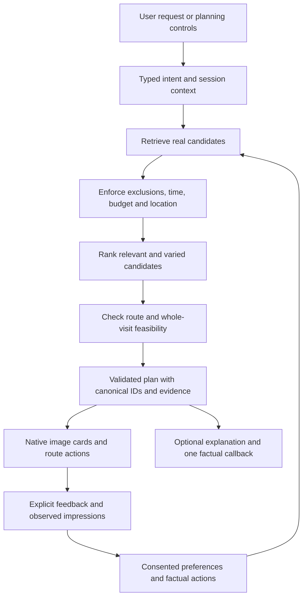

# Echoo retention and planning review

Reviewed September 15, 2026 against the current local working tree and the supplied Downloads package.

> This is the pre-implementation assessment. See [implementation and rollout status](companion-implementation-status.md) for the changes made afterward.

## Verdict

The retention direction makes sense: remember explicit preferences, reduce unwanted repetition, help people resume useful plans, and notify them only when there is something relevant. The supplied implementation is a prototype requiring adaptation and hardening. It should not be applied to the database as supplied.

Echoo has useful planning foundations. It does not yet demonstrate a reliable, learning personal companion. The main gaps are disconnected context, separate planning contracts, incomplete feasibility checks, and no demonstrated feedback-to-recommendation loop. A better prompt alone cannot close those gaps.

This review establishes local source behavior. It does not establish which version is deployed, current venue coverage, live model configuration, historical incident causes, or real retention. No application code, database, deployment, or notification schedule was changed during this review.

## 1. Current system: what is real

| Area | Evidence in the current code | Assessment |
| --- | --- | --- |
| Venue grounding | `quick-plan/index.ts` loads published Ontario canonical places and resolves Google anchors server-side. | A useful foundation for factual cards. |
| Basic personalization | Quick Plan loads completed member onboarding preferences; `personalizationFit()` matches terms and mood to venue tags. `selectStops()` combines fixed weights for budget, preferences, category, distance, and confidence. | Rules-based tailoring. No learned ranking is demonstrated in this path. |
| Plan structure | Duplicate/anchor/count checks, bounded regeneration history, explicit missing-price/hours states, and ordering permutations for up to three places. | Reusable safeguards, with feasibility gaps below. |
| Saved outing | `native-shell/src/services/outing.ts` saves active outings and recent alternatives per account on the device. | Useful resume/rotation behavior; not a durable cross-device preference history. |
| Culture | Existing migrations define `culture_catalog`, reviewed `culture_entity_tags`, and explicit user lenses. Native `CultureProvider` currently uses local storage. | Reuse this richer model; do not create a competing country-based identity model. Server preference synchronization still needs tracing/integration. |
| Companion | `plan-engine` routes local planning to `ontario-plan`; a separate Gemini path drafts conversational text. | Some sensible separation already exists. The complete user experience is not connected. |

## 2. Current planning defects and gaps

### High: companion does not receive the context its screen promises

In `native-shell/app/planner.tsx:68`, the request contains only `query` and `location`. The screen displays onboarding preferences but does not pass them. It does not retain the full previous response for the next request and sets every assistant turn to `plan: null`.

`native-shell/src/services/api.ts:368` supports `previousPlan`, but this caller never supplies it, and the API input has no profile or session identifier. The inspected companion handler relies on `body.profile`; it does not load the completed member profile the way Quick Plan does.

Consequences: follow-ups such as “make the second stop cheaper” lack the prior cards, the displayed personalization promise is unsupported by this request, and plan cards never render through this native companion path. The separate outing screen does render cards.

### High: stored companion memory does not affect the answer

`plan-engine/index.ts:2435` reads companion memories, safety constraints, and visible cards. The returned context is used to persist turns, but is not passed to `callGemini()`, `callOntarioPlan()`, or the already-built conversation state. The inspected active functions have no writer that turns feedback into durable `companion_memories`.

The memory reader/writer also has no history-consent gate. Before adding retention, define the distinction between temporary conversational context and optional durable personalization, including retention limits and deletion.

### High: “open at arrival” does not mean the visit fits

`quick-plan/planner.ts` checks opening status at the arrival instant. It does not require the planned dwell time to finish before closing. Ordering minimizes violations; it can still return a known-closed stop with a warning instead of selecting a different feasible candidate. Candidate selection happens before this hours optimization.

Reproduced with the actual exported planner: a Monday arrival at 19:55, closing at 20:00, and a 65-minute visit produces `availability: "open"`.

The loader omits `place_hours.valid_from`, `valid_to`, and `updated_at`, even though the schema contains them. Holiday overrides, split opening intervals, source freshness, last admission, and visit duration need explicit treatment before claiming a dependable schedule.

### Medium: route and budget constraints remain approximate

`travelMinutes()` uses straight-line distance with a mixed walk/ride formula clamped to 6–28 minutes. It is not a walking/transit/driving route calculation. The planner has no transport-mode input. A walkable request cannot be established by that estimate.

Budget bands are estimates, and selection broadens beyond the requested band when exact matches are scarce. A hard dollar ceiling must be a separate constraint, with unknown costs disclosed and no silent relaxation.

### Medium: parallel planner contracts and incomplete factual cards

Companion uses `plan-engine → ontario-plan`; place detail uses `quick-plan`. The Ontario companion response assembles a different stop shape and does not include venue images in `planStops`. A type conversion alone will not add verified media, hours, costs, or valid travel legs.

Converge both entry points on one validated plan contract. Preserve the existing working outing flow while adding conversational requests to it.

### Medium: failures can resemble weak inventory

Quick Plan's category fan-out discards RPC errors and substitutes empty arrays. Companion retrieval failures return deterministic recovery text. Keep user-friendly recovery, but record which stage failed and distinguish missing inventory from unavailable services.

## 3. Supplied package: adopt the ideas, repair the implementation

| Priority | Finding | Required change |
| --- | --- | --- |
| High | Schema assumes `places`, `user_profiles`, and `neighbourhood`; Echoo's active paths use `canonical_places`, `user_onboarding_profiles`, and `neighborhood`. `place_profiles` already references canonical IDs. Client imports nonexistent-in-this-project `./supabaseClient`. | Write additive, timestamped migrations against the actual schema and an adapter for the native services. Do not copy/run the package wholesale. |
| High | `renderHistoryBlock()` deletes the penultimate line repeatedly. Since avoidance lines follow recent plans, it deletes “Shown before” and then “Do not recommend” before trimming plans. | Keep exclusions as canonical IDs enforced by the server. Optional callback text may be shortened; constraints must never depend on that text surviving. |
| High | The claimed 1,600-character bound is not reliable. A single long affinity string survives after the loop stops. | Validate array lengths and field lengths; use a deterministic bounded serializer. Treat history text as data, not instructions. |
| High | `savePlan()` and `recordFeedback()` collect data without checking history consent; only history retrieval is gated. | Separate user-requested plan saving from optional recommendation memory. Enforce the chosen consent policy on server reads and writes, and account for existing companion storage. |
| High | Notification `SECURITY DEFINER` functions return user/token data or accept arbitrary user IDs without caller checks or explicit execute restrictions. | Restrict scheduler RPCs to the server role, use explicit grants/revokes, and verify anonymous and authenticated denial in database integration tests. Exposure depends on deployment grants; this review has not observed a live leak. |
| High | Push handlers do not check scheduler authorization themselves. A valid ordinary user token is not proof of scheduler authority. | Require the intended server credential/role before any candidate enumeration or sending; verify deployed gateway configuration too. |
| High | `can_send_push()` reads a count, then the worker sends, then logs. Concurrent workers can both pass the same cap. | Atomically reserve an outbox entry under a per-user lock, count reservations, and use unique campaign/user keys. Define recovery for unknown send outcomes without blind resends. |
| Medium | Workers treat HTTP `res.ok` as push success and ignore logging RPC errors. | Check individual Expo tickets, retain ticket IDs, process receipts, retire invalid tokens, and track accepted/failed/unknown states separately. |
| High | Homesick copy says “just opened” using `first_seen_at`, the import/discovery timestamp. | Use “New to Echoo” for discovery timestamps. Use opening claims only with verified opening evidence. |
| Medium | `saved`, ride-link taps, visits, and thumbs-up collapse into “engaged”; recent-plan signals are aggregated across all places. | Preserve action, venue ID, timestamp, and source. Saving a plan does not prove visiting or loving every place in it. |
| Medium | Neighborhood affinity is counted from generated recommendations, not user choices. `engaged` remains true permanently, and non-engagement has no aging policy. | Learn from explicit signals with time decay. Use unclicked impressions as a weak, expiring novelty signal. Avoid a self-reinforcing loop. |
| Medium | Plan/places/exposure writes are separate, errors are partly ignored, and retries can duplicate feedback/exposure. | Use transactional server writes, idempotency keys, and validate that feedback refers to a place actually in the plan. Record impressions when rendered, not merely generated. |
| Medium | Prompt says at most one callback, but the 5+ plans test requires exactly one. Examples say “loved” without requiring matching evidence. | Always allow zero callbacks. Use “saved,” “rated positively,” or “visited” only when that exact action is evidenced. |
| Medium | Homesick targeting derives from `home_country`, conflicting with Echoo's explicit Culture Lens design. Native culture state is not that server field. | Let people opt into updates for chosen cultures/topics; do not infer homesickness or taste from nationality. |
| Later | Referrals qualify on client-insertable plan rows; reward fulfillment is absent. | Defer until plan creation is server-verified and qualification, attribution, and entitlement changes are idempotent. |

The root README and callback document exactly match the corresponding copies inside `echoo-retention`.

### Reproduced package behavior

- Five long recent summaries plus disliked/ignored entries: the output was 1,106 characters, with both avoidance entries missing.
- One 2,000-character cuisine value: output was 2,039 characters despite the advertised 1,600-character cap.

These were executed through the supplied TypeScript's actual `renderHistoryBlock()` using the workspace TypeScript compiler. They are not speculative model failures.

## 4. A reliable companion architecture

Use the language model to interpret phrasing into a small schema and explain the validated result. The server owns venue identity, photos, opening evidence, calculations, constraints, and plan changes. Return `needs_clarification`, `no_feasible_plan`, or `partial_plan` when appropriate.

For example, “quiet date, under $80 total for two, walk only, back by 10” must become explicit fields for party size, total budget, travel mode, end time, location, and mood. Missing starting location or budget scope deserves a specific question. Explicit current instructions override soft historical preferences. Hard exclusions require an explicit change, not a model's reinterpretation.

Image cards should be normal app components populated from approved venue/media records. The model should not invent URLs or generate pictures presented as evidence of actual venues. Missing images get the existing honest fallback.

For “make the second stop cheaper,” identify the previous plan and its revision server-side, preserve the other stops, replace only the target, and validate the whole route again. Do not rely on an arbitrary client-supplied previous-plan blob as authoritative evidence.

Memory facts should resemble `{placeId, action: "saved", occurredAt, sourceEventId}`. A callback may say “You saved X last week.” A visit alone does not support “you loved X.” Start with templates for callbacks; conversational variation can come after the evidence rules work.

## 5. Integration sequence and acceptance criteria

### Phase 1 — Establish a dependable planning baseline

- Audit published venue coverage and freshness for a bounded launch area.
- Unify the plan response contract and preserve session/previous-plan context.
- Load authenticated preferences server-side and separate current constraints from preference defaults.
- Validate the whole visit against opening intervals; select replacements when a chosen combination is infeasible.
- Support explicit transport mode and genuine route estimates where required.
- Hydrate factual card fields from canonical records.
- Record failure categories, constraint violations, latency, and inventory coverage.

Acceptance: fixtures and device flows preserve anchors, cities, budgets, exclusions, and follow-up changes; every card resolves to a real source; unsupported constraints produce an honest outcome. Include the reproduced closing-time defect as a regression test.

### Phase 2 — Add durable, consented feedback

- Add plan snapshots, factual per-venue actions, bounded exposure events, and versioned preferences linked to existing auth/canonical identities.
- Make writes atomic and retry-safe; distinguish plan saved from plan generated and card shown.
- Add controls to inspect, correct, disable, and delete personalization history.
- Apply explicit exclusions before ranking; expire weak novelty signals.
- Keep operational/reward records separate and clearly define what deletion affects.

Acceptance: account isolation and consent are verified in PostgreSQL; retries do not inflate signals; revocation/deletion prevents future personalization; current explicit preferences win.

### Phase 3 — Add callbacks and limited conversation

- Start with zero-or-one evidence-backed callback in the existing outing flow.
- Add conversational intent parsing and bounded plan edits to the same planning service.
- Use a typed response contract and runtime validation; allow only approved actions and retrieved IDs.
- Evaluate parser, retrieval, planner, renderer, and wording independently. Model errors must not corrupt an otherwise valid plan.

Acceptance: multi-turn tests cover “the second one,” city changes, price changes, no history, misleading history text, disliked places, exhausted inventory, and unavailable providers. No fabricated callbacks or unsupported factual claims in the release suite. Passing that suite is a release condition, not a promise of zero future mistakes.

### Phase 4 — Add useful notifications

- Begin with an in-app resume/freshness surface, then opt-in weekend pushes.
- Implement server-only outbox reservation, campaign deduplication, quiet hours/timezones, and Expo ticket/receipt processing.
- Use explicit Culture Lens subscriptions and verified local content.
- Wire and test real destinations; the package's `echoo://weekend` needs an actual app route.

Acceptance: concurrent workers cannot exceed the configured reservation cap; failed/unknown sends are handled deliberately; disabled consent suppresses new sends; notifications open the promised content.

### Phase 5 — Measure whether personalization helps

Treat “30% Day-7 retention” as a proposed target, not an established benchmark or proof of product quality. Define the cohort and return event first. For the weekend use case, also track week-1/week-4 meaningful return, second useful plan, plan saves, explicit usefulness feedback, repeat venue complaints, notification opt-outs, and observed outing actions. A navigation tap is intent, not a verified visit.

Compare the new ranking with the existing deterministic baseline and use a notification holdout. Prevent prettier callback copy from masking worse recommendations. Add learned ranking only after sufficient reliable feedback makes its value testable.

## 6. Verification performed and limits

- `npm run typecheck` in `native-shell`: passed.
- `node --test tests/*.test.cjs` in `native-shell`: 50 passed, 0 failed.
- Three isolated executions reproduced the history-truncation, history-size, and closing-time cases above.
- No live database migration test, concurrent scheduler test, provider call, device interaction, or deployed companion evaluation was performed.
- Existing passing tests cover useful structural behavior. They do not establish real-world planning quality or validate the supplied SQL package.
- The package README's legal/compliance assertions were not independently evaluated; adding a consent flag is not evidence that the complete product meets every applicable obligation.

## Technical references checked

- [Gemini structured outputs](https://ai.google.dev/gemini-api/docs/structured-output): supports schema-constrained output for predictable parsing. Application validation and factual grounding remain responsibilities of the proposed architecture.
- [Supabase function privileges](https://supabase.com/docs/guides/database/functions): function execution is broadly allowed by default unless privileges are restricted. This supports explicitly restricting scheduler RPCs rather than assuming table RLS covers them.
- [Expo push tickets and receipts](https://docs.expo.dev/push-notifications/sending-notifications/): HTTP status alone does not establish individual message success; even successful receipts do not prove device receipt.
