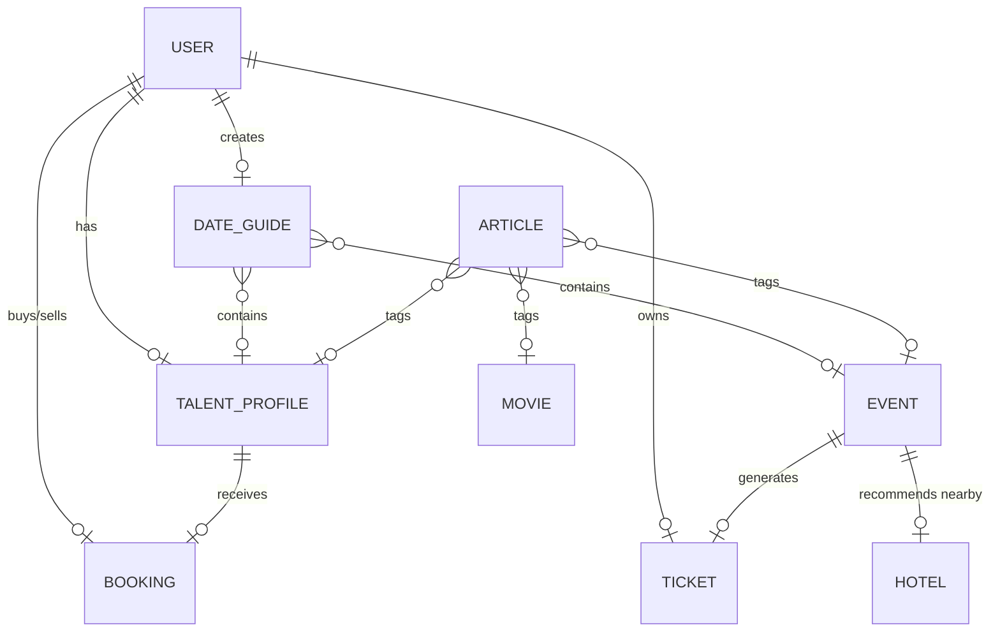
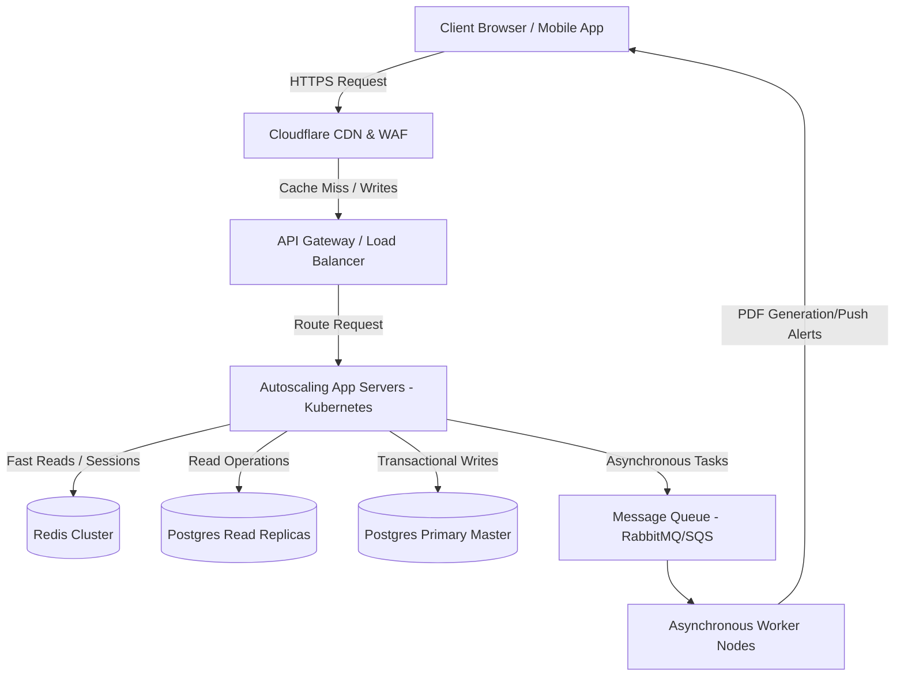

# Information Architecture (IA) — Echoo Platform

This document outlines the sitemap, database schema (data models), and critical user interaction flows that define the Echoo platform.

---

## 1. Sitemap & Page Hierarchy

The Echoo platform utilizes a unified interface structured around four user roles: Consumers, Talent/Providers, Event Promoters, and Editors.

```
[Global Navigation Bar]
 ├── Home / Landing Page
 ├── Culture Hub (News & Trends)
 ├── Find Events (Ticket Directory)
 ├── Movies & Showtimes (Cinema Portal)
 ├── Date Guides (Date Night Hotspots)
 ├── Find Talent (Vendor Directory)
 └── User Profile Menu (Tickets, Bookings, Accommodations, Settings, Inbox)
```

### 1.1 Public Pages
*   **Landing Page (`/`):** 
    *   Hero section & dynamic location-based search.
    *   Horizontal scroll of Category Cards.
    *   *Highlight:* "Date Night Suggestions" (interactive itinerary builder snippet).
    *   *Highlight:* "Trending Movies & Showtimes" (current theater listings).
    *   *Highlight:* "Upcoming Festivals & Events Near You" (local ticketing events).
*   **Culture Hub (`/culture`):**
    *   Grid view of breaking news, movie trailers, and music articles.
    *   Filter tabs: *All, Movies, Music, Nightlife, Pop Culture, Local Gossip*.
    *   **Article Detail Page (`/culture/:slug`):** Long-form content, media gallery, linked artists/events, and interactive polls.
*   **Movies & Showtimes (`/movies`):**
    *   Carousel of *Now Playing* movies.
    *   List of local theaters with showtime schedules.
    *   **Movie Detail Page (`/movies/:id`):** Trailer player, ratings, cast lists, and showtime links.
*   **Date Guides (`/date-guides`):**
    *   Directory of community and editor-curated itineraries (e.g., "Perfect Toronto Jazz Date Night").
    *   Filter tabs: *Budget, Vibe (Romantic, Cozy, Active), Neighborhood*.
    *   **Guide Details (`/date-guides/:slug`):** Sequential steps (Restaurant ➔ Show ➔ Cocktails) with links to book/buy directly.
*   **Event Directory (`/events`):**
    *   Grid of events with active search filters: *Date, Category, Price, Distance*.
    *   **Event Detail Page (`/events/:id`):** Banner, date/time, ticket booking widget, lineup/performers list, venue location, and **"Where to Stay" (Nearby Hotels List)**.
*   **Talent Directory (`/talent`):**
    *   Directory of providers with filter parameters: *Service (DJs, Bands, MCs, Photographers, Food), Rating, Price Range*.
    *   **Talent Detail Page (`/talent/:username`):** Dynamic portfolio, media player (audio/video), pricing list, customer reviews, and calendar widget.

### 1.2 Dashboard Pages (Authenticated)
*   **Consumer Hub (`/dashboard/user`):**
    *   `My Tickets`: Purchased event tickets with interactive QR codes.
    *   `My Accommodations`: Active hotel reservations and travel info.
    *   `My Bookings`: Active requests and payment histories for hired talent.
*   **Talent Portal (`/dashboard/provider`):**
    *   `Portfolio Setup`: Manage pricing, bios, video links, and Spotify embeds.
    *   `Calendar`: Track gigs, mark blackout dates, and manage booking requests.
    *   `Finances`: Connect Stripe, review earnings, and request payouts.
*   **Organizer Console (`/dashboard/organizer`):**
    *   `Event Creator`: Build ticketing events, configure tiers, and manage inventory.
    *   `Analytics`: Ticket sales metrics, check-in counts, and real-time revenue.
*   **Editorial Console (`/dashboard/editorial`):**
    *   `Automated Draft Queue`: Pre-populated articles ingested via APIs.
    *   `Feed Curation`: Re-order feed stories, push breaking news alerts, configure polls.
    *   `Guide Publisher`: Build and feature Date Night Guides.

---

## 2. Core Data Models (Database Schema)

Echoo relies on a relational data design (PostgreSQL) structured to link automated cultural content with live booking entities.



### 2.1 User Entity (`users`)
*   `id` (UUID, PK)
*   `email` (String, Unique)
*   `password_hash` (String)
*   `role` (Enum: `consumer`, `provider`, `organizer`, `editor`, `admin`)
*   `full_name` (String)
*   `current_city` (String)
*   `created_at` (Timestamp)

### 2.2 Talent Profile Entity (`talent_profiles`)
*   `id` (UUID, PK)
*   `user_id` (UUID, FK -> `users.id`)
*   `business_name` (String)
*   `category` (Enum: `music_dj`, `music_band`, `performing_arts`, `food_drink`, `photography`, `planning`)
*   `bio` (Text)
*   `portfolio_media` (Array of URLs)
*   `base_hourly_rate` (Decimal)
*   `spotify_artist_url` (String, Optional)
*   `rating_cache` (Float)

### 2.3 Event Entity (`events`)
*   `id` (UUID, PK)
*   `organizer_id` (UUID, FK -> `users.id`)
*   `title` (String)
*   `description` (Text)
*   `venue_name` (String)
*   `location_coordinates` (Point)
*   `event_date` (Timestamp)
*   `ticket_capacity` (Integer)
*   `status` (Enum: `draft`, `published`, `cancelled`, `completed`)

### 2.4 Booking Entity (`bookings`)
*   `id` (UUID, PK)
*   `client_id` (UUID, FK -> `users.id`)
*   `provider_id` (UUID, FK -> `talent_profiles.id`)
*   `event_date` (Timestamp)
*   `total_amount` (Decimal)
*   `escrow_status` (Enum: `pending_payment`, `held_in_escrow`, `released`, `disputed`, `refunded`)

### 2.5 Movie Entity (`movies`)
*   `id` (UUID, PK)
*   `tmdb_id` (Integer, Unique)
*   `title` (String)
*   `genres` (Array of Strings)
*   `release_date` (Date)
*   `trailer_url` (String)
*   `poster_url` (String)
*   `popularity_score` (Float)

### 2.6 Hotel Entity (`hotels`)
*   `id` (UUID, PK)
*   `hotel_name` (String)
*   `location_coordinates` (Point)
*   `address` (String)
*   `rating` (Float)
*   `external_booking_link` (String)

### 2.7 Date Guide Entity (`date_guides`)
*   `id` (UUID, PK)
*   `creator_id` (UUID, FK -> `users.id`)
*   `title` (String)
*   `description` (Text)
*   `itinerary` (JSONB)
*   `vibe_tags` (Array of Strings)
*   `likes_count` (Integer)

### 2.8 Article Entity (`articles`)
*   `id` (UUID, PK)
*   `headline` (String)
*   `slug` (String, Unique)
*   `summary` (Text)
*   `content` (Text)
*   `main_image_url` (String)
*   `source_api` (String)
*   `linked_talent_id` (UUID, FK -> `talent_profiles.id`, Nullable)
*   `linked_event_id` (UUID, FK -> `events.id`, Nullable)
*   `linked_movie_id` (UUID, FK -> `movies.id`, Nullable)
*   `editor_status` (Enum: `pending_review`, `approved`, `featured`, `archived`)
*   `published_at` (Timestamp, Nullable)

---

## 3. Operational Flows

### 3.1 Date Guide Compilation Flow
1.  **Selection:** A user clicks "Create a Date Guide" on their dashboard.
2.  **Assembly:** They search for a local Restaurant (Google Places integration) and a local event (Echoo database) or movie showtime, adding them sequentially to the timeline.
3.  **Tagging:** User tags the guide (e.g., `#romantic`, `#budget-friendly`, `#toronto-west`).
4.  **Publishing:** The guide goes live in the community directory, available for other users to save, like, and follow.

### 3.2 Nearby Hotel Discovery Flow
1.  **Trigger:** Consumer visits an Event Detail page (e.g., a music festival outside their hometown).
2.  **API Call:** Echoo's server checks if hotel listings near the event venue's coordinates are cached. If not, it calls the Expedia/Booking.com API for hotels within a 5km radius.
3.  **Display:** The consumer sees a list sorted by rating/proximity, showing nightly rates, and can click "Book Accommodation" (direct checkout or affiliate redirection).

---

## 4. High-Concurrency Systems Architecture

To safely serve millions of simultaneous users, the platform migrates from a standard database/monolith configuration to a distributed architecture.



### 4.1 Caching Strategy Matrix
To prevent heavy load on the database layers:
*   **Static Pages (Landing page, News articles, Movie Details):** Cached at the **Cloudflare Edge** with a TTL of 1 hour. Requests do not hit the server at all unless the cache expires.
*   **Search Lists & Directories (Talent, Events, Guides):** Cached in **Redis** with a TTL of 5 minutes. Invalidated instantly upon updates.
*   **Transient External Data (Hotels, Showtimes):** Cached in **Redis** for 6 hours to prevent API rate limit exhaustion and minimize vendor cost.
*   **Active Booking Inventory (Tickets remaining):** Stored directly in **Redis** as an in-memory counter to prevent database scans during ticket surges.

### 4.2 Ticket Drop Flow (Race Condition Control)
```
[User Clicks Buy] ➔ [Request hits API] ➔ [Lock ticket ID in Redis]
                                                 │
                   ┌─────────────────────────────┴─────────────────────────────┐
                   ▼                                                           ▼
      [Lock Successful (Ticket available)]                       [Lock Fails (Sold out)]
                   │                                                           │
        [Hold ticket for 5 min]                                   [Return 'Sold Out' status]
  [Create Stripe Checkout Session]
                   │
    [Payment Webhook Received]
                   │
  [Commit Write to Postgres Master]
  [Release Redis lock & decrement inventory]
```

### 4.3 Asynchronous Processing (Message Queue)
Tasks that do not require an immediate HTTP response are handled out-of-band:
*   **Notifications:** Event reminders, booking confirmations, and push alerts.
*   **Ticket Generation:** Creating PDF tickets and compiling QR codes.
*   **Aggregator Pipeline:** Fetching and AI-summarizing news feeds via cron schedulers.
